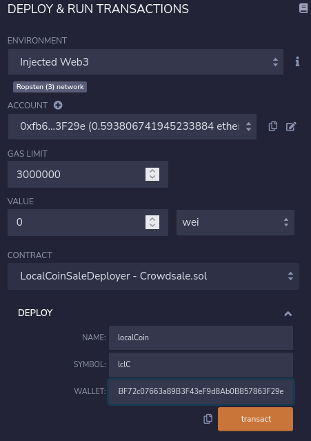
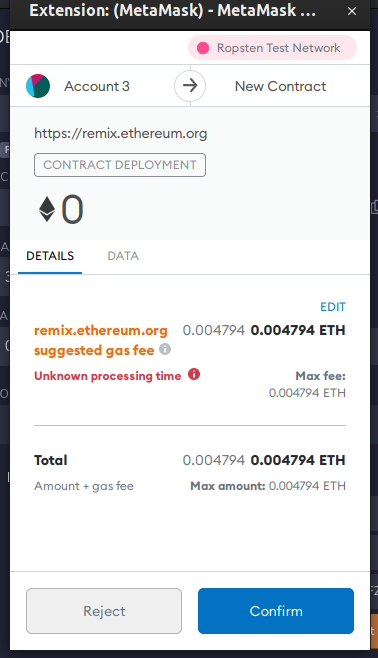
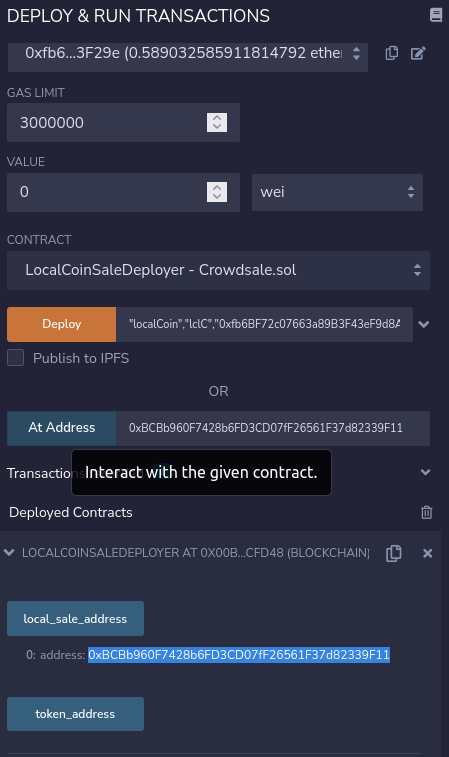
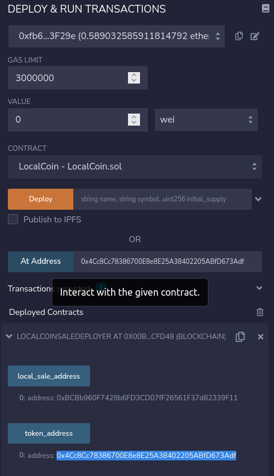
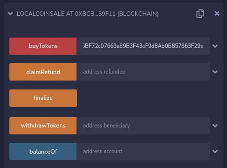

# Local Coin: Crowdsale

This repo has 3 Solidity smart contracts you can use to create an ERC20 token for crowdsale.

## 
The `LocalCoin` contract is [DEPLOYED HERE](https://ropsten.etherscan.io/address/0xbcbb960f7428b6fd3cd07ff26561f37d82339f11) on the Ropsten TestNet.